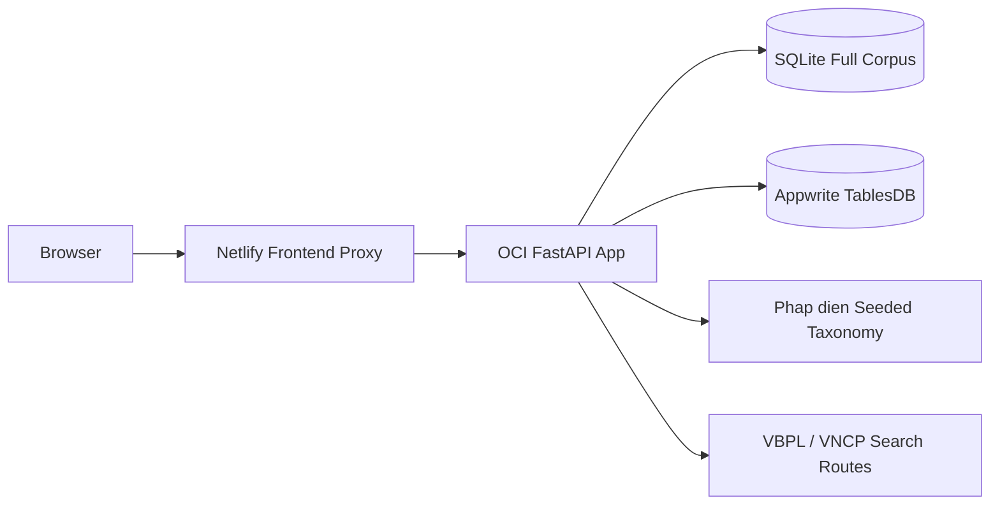
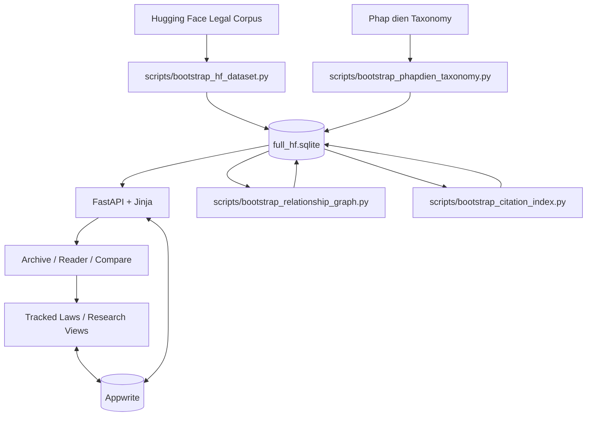

# V-Legal Prototype

V-Legal is a document-first Vietnamese legal research prototype.

It currently combines:
- a full local legal corpus from Hugging Face
- official-topic layering from Phap dien
- official search routes into `vbpl.vn` and `vanban.chinhphu.vn`
- a formal legal reader with inline cross-reference links
- tracked laws and saved research views backed by Appwrite

## Current Deployment

The live stack is:
- frontend: Netlify proxy
- backend: FastAPI on OCI VM
- corpus: SQLite at `/opt/vlegal/data/full_hf.sqlite`
- user data: Appwrite TablesDB

Current corpus size:
- documents: `10,000`
- taxonomy subjects: `42`
- relation links: `139`
- citation links: `11,194`

## What It Does

- search Vietnamese legal documents with SQLite FTS5
- filter by legal type, year, issuer, and topic
- read documents in a formal gazette-style layout
- follow inline document references inside the body text
- open provenance routes for VBPL and VNCP cross-checking
- inspect citation and lifecycle relationships between documents
- track laws and save research views for repeat monitoring
- compare two local documents side by side
- generate conservative grounded briefs from retrieved passages only

## Architecture



## Data Flow



## Repo Map

- `src/vlegal_prototype/app.py` - FastAPI routes and page assembly
- `src/vlegal_prototype/search.py` - archive search and retrieval
- `src/vlegal_prototype/structure.py` - legal text structure and inline reference linking
- `src/vlegal_prototype/citations.py` - citation extraction and graph queries
- `src/vlegal_prototype/relations.py` - lifecycle / relationship graph
- `src/vlegal_prototype/compare.py` - side-by-side compare flow
- `src/vlegal_prototype/appwrite_client.py` - tracked laws and research views
- `src/vlegal_prototype/db.py` - SQLite schema and helpers
- `templates/` - Jinja pages
- `static/` - CSS, JS, favicon
- `scripts/` - bootstrap and maintenance commands
- `deploy/oci/` - OCI Docker deployment files
- `docs/` - deployment notes and journal

## Local Development

Prerequisites:
- Python `3.12+`
- `uv`

Install:

```bash
uv sync
```

Run locally:

```bash
uv run uvicorn vlegal_prototype.app:app --reload --app-dir src
```

Open:

```text
http://127.0.0.1:8000
```

## Data Bootstrap

Small local sample:

```bash
uv run python scripts/bootstrap_hf_dataset.py --limit 500 --reset
uv run python scripts/bootstrap_phapdien_taxonomy.py --seed-only
```

Full corpus database:

```bash
set VLEGAL_DATABASE_PATH=data/full_hf.sqlite
uv run python scripts/bootstrap_hf_full_corpus.py --chunk-size 5000 --checkpoint-path data/full_hf_checkpoint.json
uv run python scripts/bootstrap_relationship_graph.py
uv run python scripts/bootstrap_citation_index.py
```

## Environment

Main app variables:
- `VLEGAL_DATABASE_PATH`
- `VLEGAL_CORS_ALLOWED_ORIGINS`
- `VLEGAL_SEARCH_PAGE_SIZE`
- `VLEGAL_ANSWER_PASSAGE_LIMIT`

Appwrite variables used by the backend:
- `APPWRITE_ENDPOINT`
- `APPWRITE_PROJECT_ID`
- `APPWRITE_DATABASE_ID`
- `APPWRITE_API_KEY`

## Deployment Docs

- `docs/DEPLOYMENT_NETLIFY_APPWRITE.md` - current Netlify + OCI + Appwrite shape
- `docs/DEPLOYMENT_OCI_VERCEL.md` - OCI backend + Vercel frontend option
- `docs/DEPLOYMENT.md` - general deployment notes
- `deploy/oci/MAINTAIN.md` - OCI maintenance tasks
- `scripts/oci_maintain.sh` - OCI helper script

## Trust Model

This is still a prototype, not a final authoritative legal-status engine.

Important limits:
- the Hugging Face corpus is a bootstrap source, not the final source of truth
- citation and lifecycle graphs are local-corpus-dependent and incomplete
- VBPL and VNCP links are search routes, not guaranteed canonical deep links
- grounded briefs are retrieval-based summaries and still require official verification

## Project Notes

- memory bank: `.agents/memory-bank/`
- development journal: `docs/JOURNAL.md`
- design direction: `DESIGN.md`
