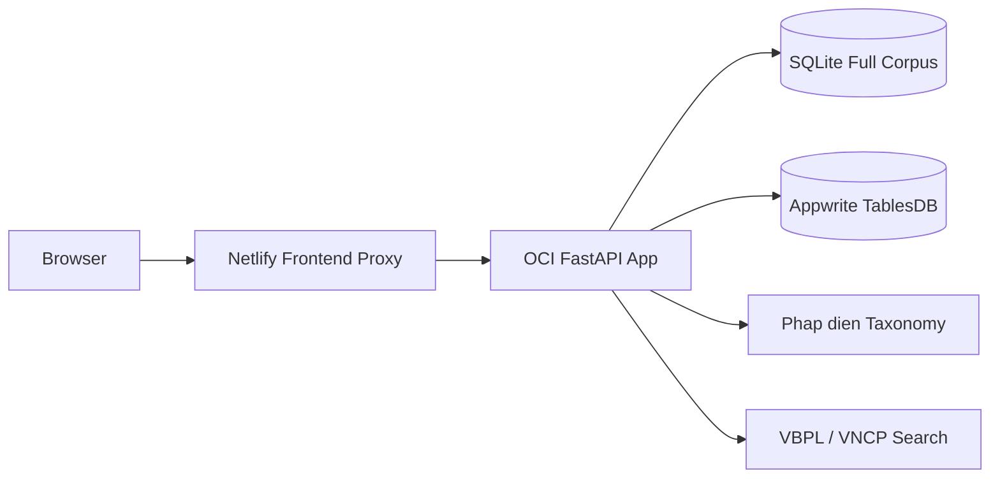
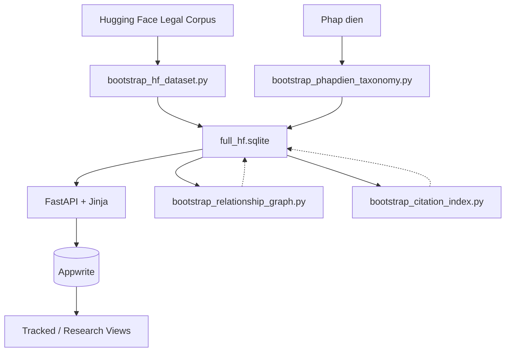

# V-Legal Prototype

V-Legal is a document-first Vietnamese legal research prototype combining:
- a focused economy/finance/industry legal corpus from Hugging Face
- official-topic layering from Phap dien
- official search routes into `vbpl.vn` and `vanban.chinhphu.vn`
- a formal legal reader with inline cross-reference links
- tracked laws and saved research views backed by Appwrite

## Current Deployment

| Layer | Technology |
|-------|------------|
| frontend | Netlify proxy |
| backend | FastAPI on OCI VM |
| corpus | SQLite at `/opt/vlegal/data/full_hf.sqlite` |
| user data | Appwrite TablesDB |

**Corpus note:** the live OCI corpus is rebuilt from Hugging Face into `/opt/vlegal/data/full_hf.sqlite` with a focused economy/finance/industry scope, while tracked laws and research views stay in Appwrite.

**Current live corpus:** `88,962` documents, `11,369` relation links, `636,769` citation links.

## What It Does

- search Vietnamese legal documents with SQLite FTS5
- filter by legal type, year, issuer, and topic
- read documents in a formal gazette-style layout
- follow inline document references inside the body text
- open provenance routes for VBPL and VNCP cross-checking
- inspect citation and lifecycle relationships between documents
- track laws and save research views for repeat monitoring
- compare two local documents side by side
- generate conservative grounded briefs from retrieved passages only

## Architecture



## Data Flow



## Repo Map

### Core Modules (`src/vlegal_prototype/`)

| File | Responsibility |
|------|---------------|
| `app.py` | FastAPI routes, page assembly, startup initialization |
| `settings.py` | Environment config via pydantic-settings |
| `db.py` | SQLite schema (FTS5, triggers), connection helpers |
| `search.py` | FTS5 search, document retrieval, filtering |
| `structure.py` | Legal text structure, inline reference linking |
| `citations.py` | Citation extraction, graph queries |
| `relations.py` | Lifecycle/relationship graph |
| `compare.py` | Side-by-side document comparison |
| `appwrite_client.py` | Tracked laws, research views (Appwrite) |
| `answering.py` | Grounded brief generation |
| `provenance.py` | VBPL/VNCP provenance profiles |
| `tracking.py` | Same-subject update alerts |

### Bootstrap Scripts (`scripts/`)

| Script | Purpose |
|--------|---------|
| `bootstrap_hf_dataset.py` | Import legal corpus from Hugging Face |
| `bootstrap_hf_focused_corpus.py` | Rebuild the economy/finance/industry-focused corpus |
| `bootstrap_phapdien_taxonomy.py` | Seed taxonomy subjects |
| `bootstrap_relationship_graph.py` | Build lifecycle relations |
| `bootstrap_citation_index.py` | Extract and index citations |
| `bootstrap_appwrite.py` | Sync tracked docs to Appwrite |
| `prepare_demo_bundle.py` | Prepare preview bundle |
| `repair_document_dates.py` | Fix date inconsistencies |
| `oci_maintain.sh` | OCI maintenance helper |

### Other
- `templates/` - Jinja2 HTML pages
- `static/` - CSS, JavaScript, favicon
- `deploy/oci/` - Docker and deployment configs
- `docs/` - Deployment notes, journal

## Local Development

### Prerequisites
- Python `3.12+`
- `uv`

### Quick Start

```bash
# Install dependencies
uv sync

# Run locally
uv run uvicorn vlegal_prototype.app:app --reload --app-dir src
# Open http://127.0.0.1:8000
```

### Verification Commands

```bash
# Syntax check all Python
uv run python -m compileall src scripts

# Health check (with server running)
curl http://127.0.0.1:8000/health
```

## Data Bootstrap

### Small local sample (500 docs)
```bash
uv run python scripts/bootstrap_hf_dataset.py --limit 500 --reset
uv run python scripts/bootstrap_phapdien_taxonomy.py --seed-only
```

### Continue from offset
```bash
uv run python scripts/bootstrap_hf_dataset.py --skip 2000 --limit 2000
```

### Full corpus
```bash
set VLEGAL_DATABASE_PATH=data/full_hf.sqlite
uv run python scripts/bootstrap_hf_dataset.py --chunk-size 5000 --checkpoint-path data/full_hf_checkpoint.json
uv run python scripts/bootstrap_relationship_graph.py
uv run python scripts/bootstrap_citation_index.py
```

### Focused economy / finance / industry corpus
```bash
set VLEGAL_DATABASE_PATH=data/full_hf.sqlite
uv run python scripts/bootstrap_hf_focused_corpus.py --reset
```

See `docs/FOCUSED_CORPUS_SCOPE.md` for the inclusion and exclusion rules.

### Preview bundle
```bash
uv run python scripts/prepare_demo_bundle.py --limit 500 --seed-only-taxonomy
```

## Environment Variables

| Variable | Default | Description |
|----------|---------|-------------|
| `VLEGAL_DATABASE_PATH` | `data/vlegal.sqlite` | SQLite corpus location |
| `VLEGAL_CORS_ALLOWED_ORIGINS` | `*` | CORS origins |
| `VLEGAL_SEARCH_PAGE_SIZE` | `20` | Results per page |
| `VLEGAL_ANSWER_PASSAGE_LIMIT` | `5` | Passages for brief generation |
| `VLEGAL_APPWRITE_ENDPOINT` | - | Appwrite API endpoint |
| `VLEGAL_APPWRITE_PROJECT_ID` | - | Appwrite project ID |
| `VLEGAL_APPWRITE_DATABASE_ID` | - | Appwrite database ID |
| `VLEGAL_APPWRITE_API_KEY` | - | Appwrite API key |

## Testing

Once pytest is installed:
```bash
# Run all tests
uv run python -m pytest tests/ -v

# Run specific test file
uv run python -m pytest tests/test_search.py -q

# Run specific test function
uv run python -m pytest tests/test_search.py -k test_search_documents -q
```

Test files should mirror `src/` structure (e.g., `tests/test_search.py` for `search.py`).

## Manual Verification Routes

After starting the server:
- `/` - Home/search
- `/tracking` - Tracked documents
- `/documents/{id}` - Document detail
- `/compare/{left_id}/{right_id}` - Side-by-side compare
- `/health` - Health check

## Deployment Docs

| Document | Content |
|----------|---------|
| `docs/DEPLOYMENT_NETLIFY_APPWRITE.md` | Current Netlify + OCI + Appwrite |
| `docs/DEPLOYMENT_OCI_VERCEL.md` | OCI backend + Vercel frontend |
| `docs/DEPLOYMENT.md` | General deployment notes |
| `docs/FOCUSED_CORPUS_SCOPE.md` | Focused economy/finance/industry corpus rules |
| `deploy/oci/MAINTAIN.md` | OCI maintenance tasks |
| `DESIGN.md` | Visual design system |

## Trust Model

This is a prototype, **not** an authoritative legal-status engine.

**Limitations:**
- Hugging Face corpus is a bootstrap source, not final source of truth
- Citation and lifecycle graphs are local-corpus-dependent and incomplete
- VBPL and VNCP links are search routes, not guaranteed canonical deep links
- Grounded briefs are retrieval-based summaries requiring official verification

## Project References

- Design direction: `DESIGN.md`
- Agent guidance: `AGENTS.md`
- Development journal: `docs/JOURNAL.md`
- Memory bank: `.agents/memory-bank/`
